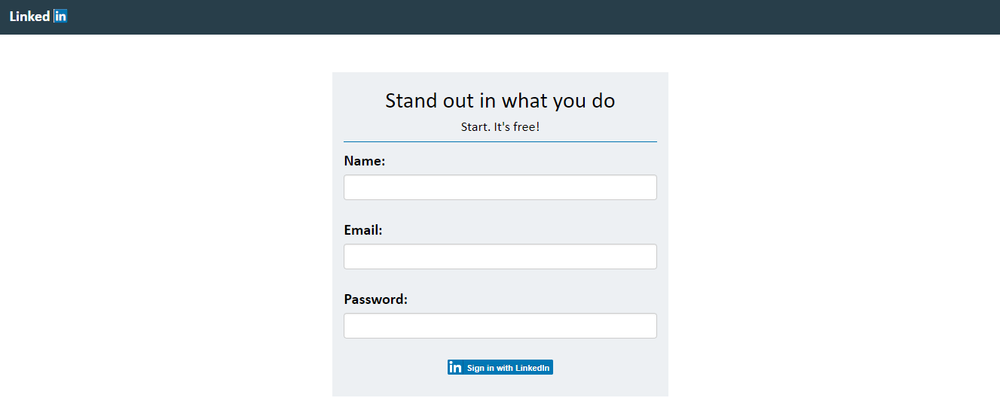
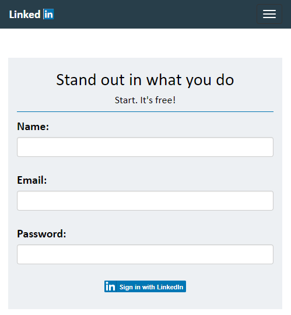
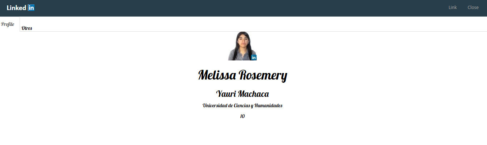
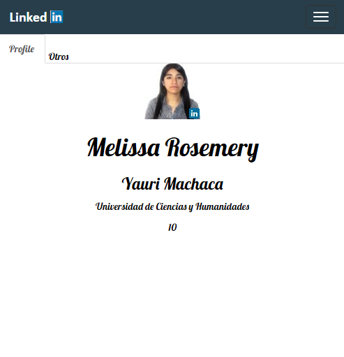

# LINKEDIN - La mayor red profesional del mundo

## Objetivo
Realizar una plataforma con el API Linkedin.

## Herramientas
* Javascript: Para el manejo de la API linkedin.
* Html: Para la estructura del documento.
* [Api Linkedin](https://developer.linkedin.com/)
* Bootstrap: Framework para el diseño del documento.

## Flujo de aplicación
- La plataforma te solicita que inicies sesión con linkedin.

 **Layout desktop**

 

  **Layout mobile**

 

- Seguidamente la plataforma te redicciona a tu propio perfil.En el cual encontarás lo siguiente:

 - Foto de perfil
 - Nombre y apellidos
 - Una referencia(universidad- carrera profesional)
 - Número de contactos

 **Layout desktop**

 

 **Layout mobile**

 
